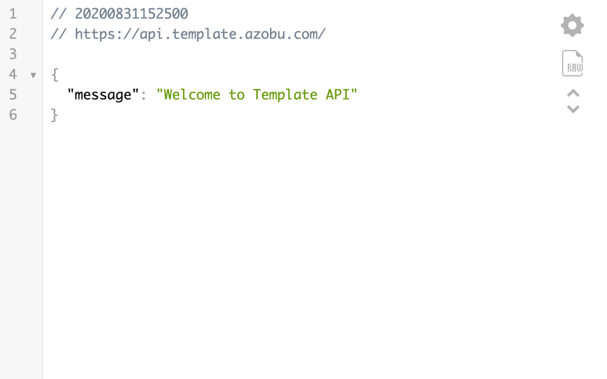
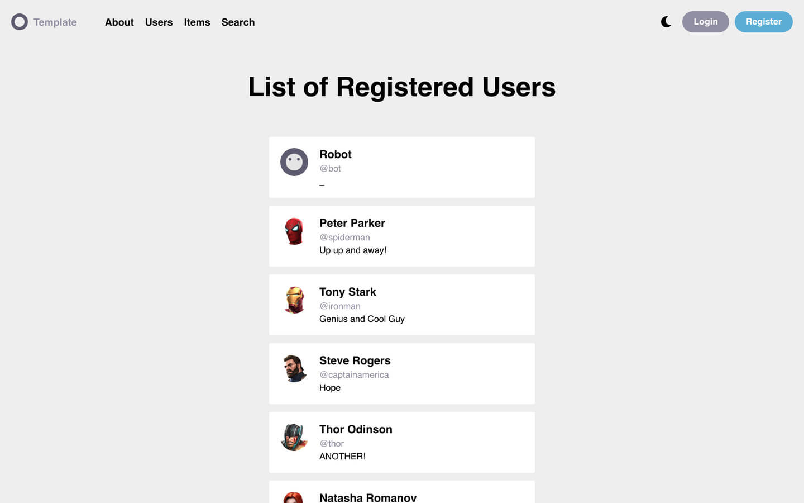
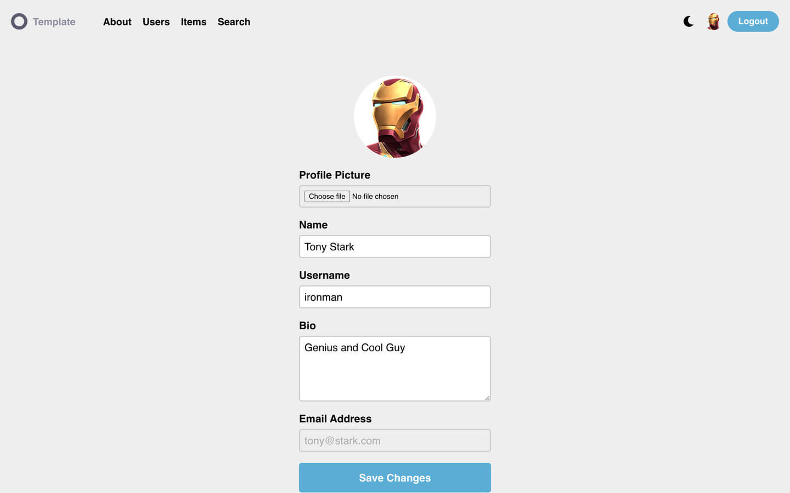

# ⭕ Template

> [Template](https://template.azobu.com) is a quick starter kit project to build a complete web app and API with highly opiniated technologies and structure around JavaScript ecosystem.

|                            Template Web                             |                              Template API                              |
| :-----------------------------------------------------------------: | :--------------------------------------------------------------------: |
|  |  |
|          [template.azobu.com](https://template.azobu.com)           |        [api.template.azobu.com](https://api.template.azobu.com)        |

## Table of Contents

- [🌐 Links](#-links-)
- [🏆 Use Cases](#-use-cases-)
- [💡 Inspirations](#-inspirations-)
- [📚 Features](#-features-)
- [🎨 Designs](#-designs-)
- [👤 Authors](#-authors-)
- [🤝 Contribution](#-contribution-)
- [🎁 Support](#-support-)
- [📝 License](#license-)

## 🌐 Links [🔝](#-template)

The production applications with their corresponding repositories:

- [Template Web](https://template.azobu.com)
  - [`template-web`](https://github.com/azobu-projects/template-web)
- [Template API](https://api.template.azobu.com)
  - [`template-api`](https://github.com/azobu-projects/template-api)
- (Later) Template Android
- (Later) Template iOS

Documentation and design:

- [Template Specifications for Web](specifications-web.md) (Markdown)
- [Template Specifications for API](specifications-api.md) (Markdown)
- [Template Ideation](https://miro.com/app/board/o9J_kmcKK1M=/) (Miro)
- [Template Web Sitemap](https://whimsical.com/UJymQjk4q72BcpWYLnJ3ZB) (Whimsical)
- [Template Web Design](https://figma.com/file/gyEXMrNXwVEBfdrSkJlJYV/Template?node-id=450%3A2) (Figma)
- [Template Web Prototype](https://figma.com/proto/gyEXMrNXwVEBfdrSkJlJYV/Template?node-id=452%3A2&scaling=min-zoom) (Figma)

Ultimately this base application can be adapted into other sites and apps:

- ⭐ [Azobu](https://azobu.com) learning platform
- 🗼 [Acme](https://acme.azobu.com) company profile
- 📝 [Yesdo](https://yesdo.azobu.com) task tracking and note taking
- 📞 [Connecto](https://connecto.azobu.com) contact and address book manager
- 🌌 [The Galactic News](https://thegalacticnews.azobu.com) news portal
- 🌏 [Earthling](https://earthling.azobu.com) social media
- 🪐 [Planetary](https://planetary.azobu.com) job board
- 👋 [Jankenpon](https://jankenpon.azobu.com) rock-paper-scissors game
- [and much more](https://azobu.com/projects)

## 🏆 Use Cases [🔝](#-template)

- Main contents
  - View home page content
  - View about page content
  - View all users
  - View user profile
  - View all items
  - View item detail
  - Search items with keyword
- Authentication and authorization
  - Register new user with name, username, email, and password
  - Login to user with email and password
  - Logout from logged in user with confirmation
  - Request to reset password using email
- User account
  - Update user settings to change name, username, and bio
  - Upload new profile picture or avatar
  - Delete user account
  - Post new item
- Development mode
  - Not found page
  - Upload single file or multiple files
  - Debug JSON data from API, for use of Redux and Redux Thunk
- Utilities
  - Toggle color mode (default and dark)
  - Switch between register and login from each page

## 💡 Inspirations [🔝](#-template)

The main reason Template is built is because there are tons of template and boilerplate out there, but they are often not complete. Also we don't find which suit the needs of our projects and products, which has more requirements than them. Other than that, it's mostly for learning purpose.

The technical side of Template is inspired by:

- [Material Design Kit](https://materialdesignkit.com)
- [RealWorld.io](https://github.com/gothinkster/realworld)
  - [`react-redux-realworld`](https://github.com/gothinkster/react-redux-realworld-example-app)
  - [`node-express-realworld`](https://github.com/gothinkster/node-express-realworld-example-app)
- [React.js Boilerplate](https://reactboilerplate.com)
- [Express application generator](https://expressjs.com/en/starter/generator.html)
- and other related repos

They're great, but not as we expected:

- No complete process from ideation and design to implementation of frontend and backend.
- The design is not simple or outdated.
- Might be too little or too big for a starter kit.
- Some of the important development and deployment tools are not there.
- Missing practices on various configuration, integration, and deployment.
- Often too slow to build.

Then instead of taking different programming languages at once, Template is made to be highly opiniated for just around JavaScript and Node.js ecosystem. Because the main goal is to be a quick starter kit for **new** professional developers, especially who we teach frequently in [Azobu](https://azobu.com).

## 📚 Features [🔝](#-template)

### Current Features

- Highly opiniated structure to start a project faster
  - Focused on JavaScript, Node.js, React, and Express ecosystem
  - Later possible with TypeScript too
- Simple and good-looking user interface (UI) and quick user experience (UX)
  - Ideation powered by Miro and Whimsical
  - Design powered by Figma
  - Code powered by React, React Router, Redux, and CSS-in-JS (`xstyled` and `emotion`)
  - Albeit the opiniated specification, Template want to enable good end-user experience
  - Adapting inspirations from apps like Google, Twitter, Instagram, Medium, and Airbnb
- Encouraged with popular best practices and recommendations
  - Intuitive React Redux structure
  - Intuitive Express structure
  - Clean Code
  - The Twelve-Factor App
  - Continuous Integration and Deployment (CI/CD)
- Communication with popular and standard HTTP-based API
  - Powered by REST API. Maybe later by GraphQL API too
- Frontend and backend documentations
  - Leveraged by simple table for web pages and API endpoints
- Interactive documentation of the API endpoints
  - Powered by Postman
  - (Alternative) Swagger or API Blueprint
- Optimized developer experience (DX) through npm/yarn scripts
  - Leveraged by `package.json` and PM2 with `ecosystem.config.js`
  - Automated deployment by Netlify and Circle CI
- Watch changes with hot reload for React and auto restart for Node.js
  - Powered by React Scripts (Webpack and Babel), Nodemon, and PM2
- Flexible customizable interface with color theme, especially dark mode
  - Powered by `styled-system`, `xstyled`, and `emotion`
  - Not using premade design such as Bootstrap or Material Design
- Better debugging experience for global app state and local form state
  - Powered by Redux Logger, Redux DevTools Extension, and React Hook Form
  - (Alternative) Formik or React Final Form
- Get and display data resources such as users and items
  - Powered by Axios, Redux Thunk, and `async`/`await` for asynchronous handling
  - Using standardized names of action types
- Adaptive page title based on location path and data condition
  - Powered by React Helmet Async and nice favicons
- Search and filter items with adapted browser URL query
  - Powered by combination of Redux, React Router, and `query-string`
- Authentic and cool-looking initial seed users and items
  - Sourced from Marvel universe's characters and items
  - Not using fake data generator
- Easy to use database technologies
  - Powered by MongoDB with Mongoose or PostgreSQL with Sequelize
- Simple user authentication and authorization flow with basic security
  - Powered by Web Storage API, HTTP Cookie, `bcrypt`, JSON Web Token (JWT), CORS, and Helmet
  - Not using Passport for basic email and password
- Log HTTP API requests
  - Powered by `morgan` Express middleware
- Proper response of message and error
  - Using Express middlewares with advised HTTP response status
- Edit user profile and upload files/images
  - Powered by `multer` Express middleware using `FormData`
  - (Alternative) Separated storage engine for static assets:
    - Google Storage Engine
    - Cloudinary
- Multi environment configurations and variables for development, test, and production
  - Powered by React Scripts and `dotenv-flow` to manage `.env` files
- Helpful analytical data tracking
  - Powered by Google Analytics and `React-GA`
- Vibrant utilities for various case of other features:
  - `dayjs` date parser on `datetime`
  - Image or component lazy loader on `img`
  - HTML string parser on raw HTML data
  - WYSIWYG editor to generate raw HTML data
  - Code syntax highlighter on `pre` with `code`
  - (Alternative) Markdown editor and parser
- Consistent code quality using static test linter and code formatter
  - Powered by ESLint, Prettier, and Standard
  - Encouraging to use `prop-types` in React
- Reliable secure server hosting and configuration, with HTTPS
  - Powered by Netlify, Google Cloud Platform, Nginx, Let's Encrypt, Cloudflare, and Uniregistry
- Intuitive CI/CD tools to manage deployment process
  - Powered by Netlify CI and Circle CI
- Send email for registration confirmation and password reset link
  - Powered by Nodemailer and Mailgun
- Application monitoring with error and log tracking
  - Powered by Sentry and LogRocket

Some stack alternatives are listed in each repository's documentation.

### Later Features [🔝](#-template)

- Automated test suite with end-to-end test, integration test, unit test, and test coverage
  - Powered by Cypress, Jest, Sinon, React Testing Library, and `supertest`/`supertest-fetch`
- Pagination and indexing on client and server side
- Remote data caching
  - Powered by React Query or SWR
- Dedicated administrator dashboard for data management and visualization
  - Powered by D3.js
- Periodic dependency cleaning and vulnerability monitoring by Greenkeeper and Snyk
- Support for Geolocation API
- Support for payment gateway
  - Powered by Stripe, Braintree, PayPal, or Midtrans
- Real-time full text search
  - Powered by Algolia or Elasticsearch
- Offline-first mode powered by Progressive Web App (PWA) approach
- Role-based access control (RBAC)
  - Powered by CASL
- Alternative on REST API with query language
  - Powered by GraphQL API and Prisma
- Consultation with the developers
- Explanation with videos

## 🎨 Designs [🔝](#-template)

| Name           | Screenshots                                  |
| -------------- | -------------------------------------------- |
| Home           |            |
| Home Dark      |       |
| About          |           |
| Not Found      |       |
| Users          |           |
| User Profile   |    |
| Items          |           |
| Item           |            |
| Search Results |  |
| Login          |           |
| User Settings  |   |
| Logout         |          |

## 👤 Authors [🔝](#-template)

- [M Haidar Hanif](https://mhaidarhanif.com) ([@mhaidarh](https://github.com/mhaidarh))
- [Azobu Team](https://azobu.com) ([@azobu](https://github.com/azobu))

## 🤝 Contribution [🔝](#-template)

Contributions, issues, and feature requests are welcome!

## 🎁 Support [🔝](#-template)

Give a ⭐️ if this project helped or inspired you!

## 📝 License [🔝](#-template)

See [LICENSE](./LICENSE)
